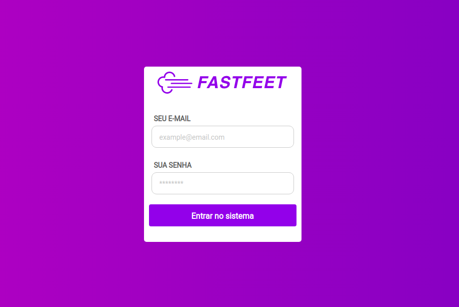

<h1 align="center">
  
</h1>

<p align="center">
  
</p>

<h3 align="center">
  FastFeet is an app for a fictional shipping company, developed with ReactJS during Rocketseat's Bootcamp. This project is part of Rocketseat's Bootcamp certification.
</h3>

---



## Installing and Running

Clone the repository

```bash
git clone https://github.com/tavareshenrique/fastfeet-web.git
```

```bash
# Install the dependencies
yarn
# or
npm install

# Run the FastFeet Back-End before running the FastFeet Web project
https://github.com/tavareshenrique/fastfeet-api

# Run FastFeet Web
yarn start
# or
npm start
```

## Technologies

- [ReactJS](https://pt-br.reactjs.org/)
- [React Hooks](https://pt-br.reactjs.org/docs/hooks-intro.html)
- [Rocketseat/Unform](https://github.com/Rocketseat/unform)
- [Axios](https://github.com/axios/axios)
- [Antd](https://ant.design/docs/react/introduce)
- [date-fns](https://date-fns.org/)
- [History](https://www.npmjs.com/package/history)
- [Immer](https://github.com/immerjs/immer)
- [Polished](https://github.com/styled-components/polished)
- [Prop-Types](https://www.npmjs.com/package/prop-types)
- [React Icons](https://react-icons.netlify.com/#/)
- [React Helmet](https://github.com/nfl/react-helmet)
- [Redux](https://redux.js.org/)
- [React Router DOM](https://reacttraining.com/react-router/web)
- [React Toastify](https://github.com/fkhadra/react-toastify)
- [React Loading Overlay](https://github.com/derrickpelletier/react-loading-overlay#readme)
- [React Responsive Modal](https://github.com/pradel/react-responsive-modal#readme)
- [React Spinners](https://github.com/davidhu2000/react-spinners)
- [Reactotron](https://github.com/infinitered/reactotron)
- [Redux Persist](https://github.com/rt2zz/redux-persist)
- [Styled Components](https://www.styled-components.com/)
- [yup](https://github.com/jquense/yup)
- [ESLint](https://eslint.org/)
- [Prettier](https://prettier.io/)
- [React App Rewired](https://github.com/timarney/react-app-rewired)

## Author

<table>
  <tr>
    <td align="center">
      <a href="http://github.com/tavareshenrique/">
        
        <br />
        <sub>
          <b>Henrique Tavares</b>
        </sub>
       </a>
       <br />
       <a href="https://github.com/tavareshenrique/FASTFEET-WEB/commits?author=tavareshenrique" title="Code">@tavareshenrique</a>
    </td>
  </tr>
</table>

## License

This project is licensed under the MIT license - see the archive [LICENSE.md](https://github.com/tavareshenrique/fastfeet-web/blob/master/LICENSE.md) for details.
